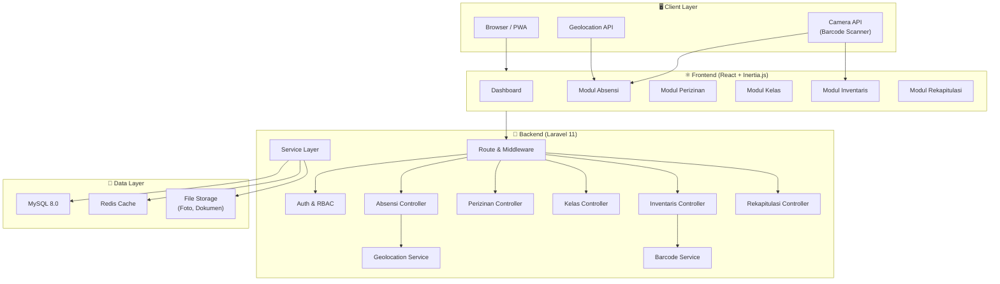
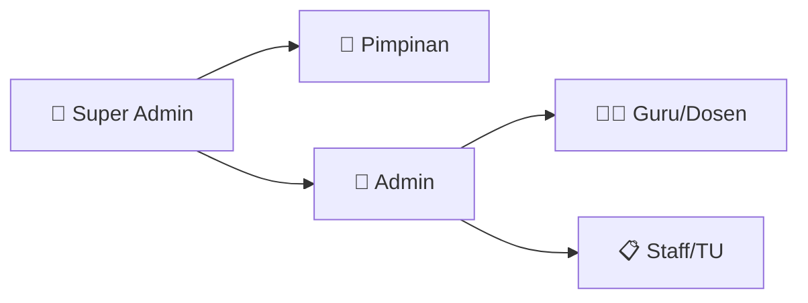
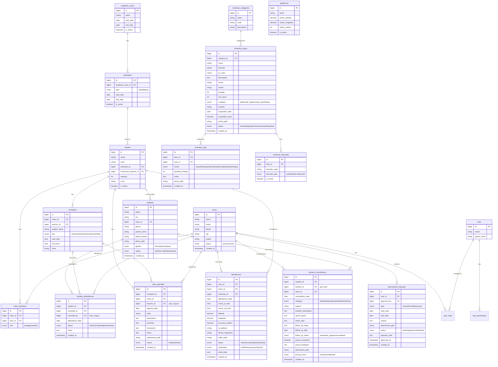
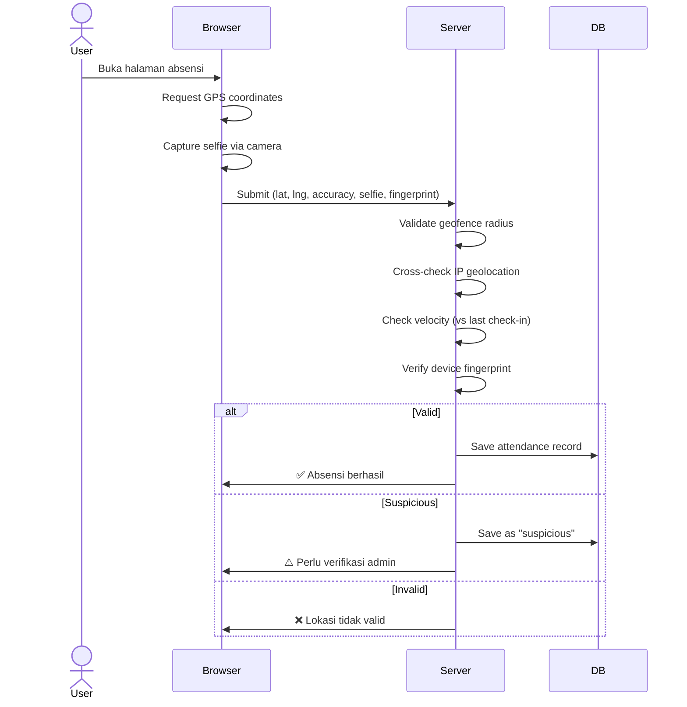
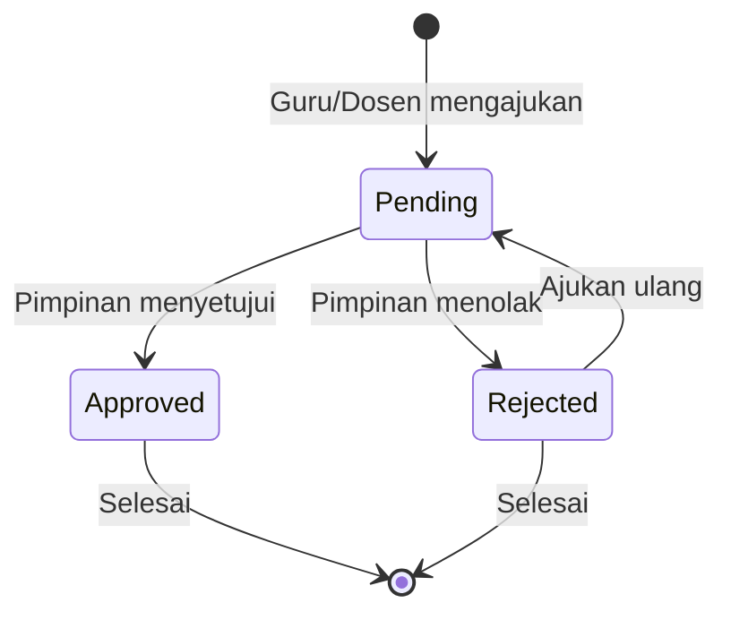
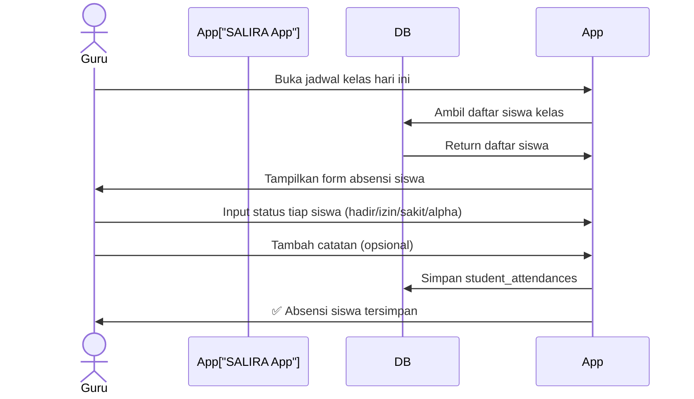
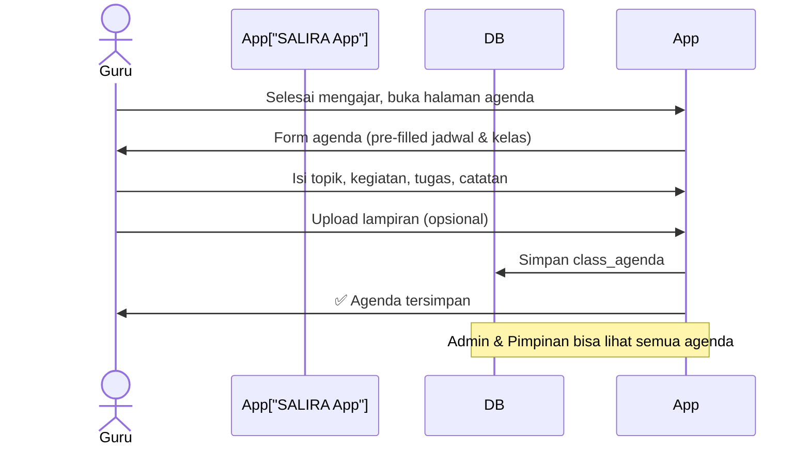
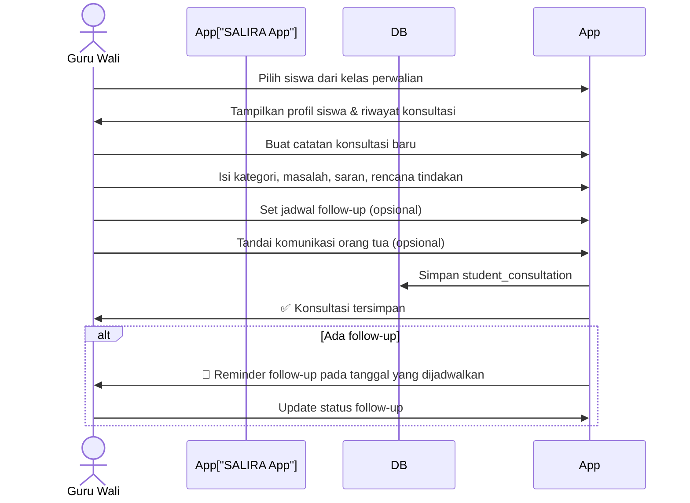
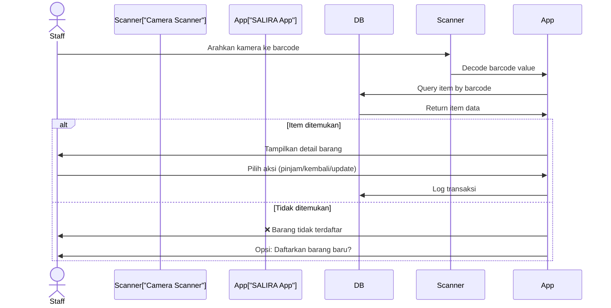

# SALIRA — Sistem Absensi, Logistik, Inventaris, & Rekapitulasi Akademik

## Ringkasan Proyek

SALIRA adalah sistem manajemen akademik terpadu yang mengintegrasikan:
1. **Absensi Geolocation** — Presensi berbasis lokasi dengan anti-fake GPS
2. **Perizinan** — Manajemen izin & cuti dengan workflow approval
3. **Administrasi Kelas** — Pengelolaan kelas, jadwal, dan akademik
4. **Inventaris Barcode** — Pencatatan & pelacakan barang dengan barcode/QR code
5. **Rekapitulasi Akademik** — Laporan & rekap data akademik

Sistem dirancang modular agar mudah dikembangkan ke depan.

---

## Tech Stack

### Backend
| Teknologi | Versi | Alasan |
|:---|:---|:---|
| **Laravel** | 11.x | Framework PHP terpopuler, aaPanel-friendly, ekosistem luas |
| **PHP** | 8.3+ | Performa terbaik, fitur modern (fibers, readonly, enums) |
| **MySQL** | 8.0+ | Relational DB, didukung penuh aaPanel |
| **Redis** | 7.x | Caching, queue, session (opsional tapi direkomendasikan) |

### Frontend
| Teknologi | Alasan |
|:---|:---|
| **Inertia.js** | SPA-like experience tanpa perlu API terpisah, integrasi seamless dengan Laravel |
| **React 18** | Komponen reactive, ekosistem besar, komunitas aktif |
| **TypeScript** | Type safety untuk maintainability jangka panjang |
| **Vite** | Build tool modern, HMR super cepat |

### Library Pendukung
| Library | Fungsi |
|:---|:---|
| **html5-qrcode** | Scanner barcode/QR via kamera device |
| **JsBarcode** | Generate barcode (Code128, EAN-13, dll) |
| **Leaflet.js** | Peta interaktif untuk visualisasi geolocation |
| **Chart.js / Recharts** | Grafik & statistik dashboard |
| **Laravel Sanctum** | API authentication |
| **Spatie Permission** | Role & permission management |
| **Laravel Excel** | Export data ke Excel/CSV |
| **DomPDF** | Generate laporan PDF |

### Deployment (aaPanel)
| Komponen | Setup |
|:---|:---|
| **Web Server** | Nginx (reverse proxy) |
| **PHP** | PHP 8.3 via aaPanel PHP Manager |
| **Database** | MySQL 8.0 via aaPanel |
| **Node.js** | v20 LTS (untuk build frontend assets) |
| **SSL** | Let's Encrypt via aaPanel |
| **Queue** | Supervisor + Laravel Queue |

---

## Arsitektur Sistem



---

## Role & Permission



| Role | Akses |
|:---|:---|
| **Super Admin** | Full access, kelola semua modul & konfigurasi sistem |
| **Pimpinan** | Final approval perizinan, lihat laporan absensi, inventaris, rekapitulasi & semua rekap (read-only dashboard) |
| **Admin** | Kelola user, kelas, inventaris, lihat semua rekap |
| **Guru/Dosen** | Absensi geolocation (check-in/out), **absensi siswa** (input kehadiran per kelas), **agenda kelas**, **konsultasi siswa/guru wali** (catatan bimbingan, follow-up, komunikasi orang tua), ajukan perizinan, lihat jadwal & nilai, input nilai |
| **Staff/TU** | Kelola inventaris, proses perizinan, administrasi |

---

## Desain Database (ERD)



---

## Detail Modul

### 1. 📍 Modul Absensi Geolocation (Guru/Dosen)

#### Fitur Utama
- **Check-in/Check-out** dengan validasi GPS koordinat
- **Geofencing** — Tentukan radius area yang valid untuk absensi
- **Anti-Fake GPS** (multi-layer verification):
  - Validasi koordinat vs IP geolocation
  - Device fingerprinting
  - Selfie verification (foto saat check-in)
  - Server-side velocity check (deteksi perpindahan tidak wajar)
  - Accuracy threshold (tolak jika akurasi GPS > 100m)
- **Peta visualisasi** — Leaflet.js map menampilkan lokasi check-in
- **Auto-alpha** — Otomatis tandai alpha jika tidak absen
- **Riwayat absensi** dengan filter tanggal, kelas, status

#### Flow Absensi


---

### 2. 📋 Modul Perizinan

#### Fitur Utama
- **Form pengajuan** izin/sakit/cuti/dispensasi
- **Upload lampiran** (surat dokter, surat keterangan, dll)
- **Workflow approval 2 tingkat**: Guru/Dosen → Pimpinan (approval)
- **Notifikasi** real-time saat status berubah
- **Kalender** perizinan terintegrasi
- **Auto-link** ke absensi (izin approved → status absensi otomatis "izin")

#### Status Flow


---

### 3. 📝 Modul Absensi Siswa (dikelola Guru/Dosen)

#### Fitur Utama
- **Input kehadiran siswa** per sesi/jadwal kelas
- **Daftar siswa** per kelas dengan foto & data singkat
- **Status kehadiran**: Hadir, Izin, Sakit, Alpha, Terlambat
- **Catatan per siswa** — guru bisa tambah keterangan
- **Rekap kehadiran siswa** per kelas per periode
- **Quick-action** — centang cepat seluruh kelas hadir, lalu edit individual
- **Riwayat absensi siswa** — filter per siswa, per kelas, per tanggal
- **Export** rekap absensi siswa ke Excel/PDF

#### Flow Absensi Siswa


---

### 4. 🏫 Modul Administrasi Kelas

#### Fitur Utama
- **CRUD kelas** dengan kode unik
- **Kelola pengajar kelas** (guru/dosen pengajar & asisten)
- **Kelola data siswa** per kelas (CRUD siswa)
- **Jadwal pelajaran** per kelas per hari
- **Tahun ajaran & semester** management
- **Wali kelas** assignment
- **Ruang kelas** mapping
- **Dashboard kelas** — overview absensi guru & siswa, jadwal hari ini, pengajar

---

### 5. 📅 Modul Agenda Kelas (Guru/Dosen)

#### Fitur Utama
- **Buat agenda** per sesi/jadwal kelas
- **Topik & deskripsi** materi yang diajarkan
- **Kegiatan pembelajaran** — catatan aktivitas kelas
- **Tugas/PR** — input tugas yang diberikan ke siswa
- **Catatan tambahan** — observasi, kendala, dll
- **Upload lampiran** — file materi, foto kegiatan
- **Status**: Draft / Published
- **Riwayat agenda** — timeline agenda per kelas
- **Terintegrasi dengan absensi** — agenda otomatis terhubung dengan data absensi sesi tersebut

#### Flow Agenda


---

### 6. 🤝 Modul Konsultasi Guru Wali

#### Fitur Utama
- **Catatan konsultasi** — rekam sesi bimbingan/konsultasi dengan siswa
- **Kategori masalah**: Akademik, Perilaku, Pribadi, Karir, Lainnya
- **Detail sesi** — deskripsi masalah, saran yang diberikan, rencana tindakan
- **Follow-up tracking** — jadwal & status tindak lanjut (pending/in progress/completed)
- **Komunikasi orang tua** — catat apakah sudah menghubungi orang tua & feedback-nya
- **Level privasi** — Normal / Confidential (confidential hanya bisa dilihat guru wali & pimpinan)
- **Upload lampiran** — dokumen pendukung
- **Riwayat konsultasi** per siswa — timeline lengkap bimbingan
- **Dashboard guru wali** — overview siswa perwalian, follow-up pending, statistik konsultasi
- **Export rekap** konsultasi per kelas/periode ke PDF

#### Flow Konsultasi


---

### 7. 📦 Modul Inventaris Barcode

#### Fitur Utama
- **CRUD barang** dengan kategori
- **Generate barcode/QR code** otomatis per item
- **Scan barcode** via kamera device (html5-qrcode)
- **Cetak label barcode** (batch print)
- **Tracking kondisi** barang (baik/rusak ringan/rusak berat/hilang)
- **Log mutasi** barang (masuk/keluar/pinjam/kembali)
- **Peminjaman & pengembalian** dengan scan barcode
- **Stok minimum alert** — notifikasi saat stok di bawah minimum
- **Export** data inventaris ke Excel/PDF

#### Flow Scan Barcode


---

### 8. 📊 Modul Rekapitulasi Akademik

#### Fitur Utama
- **Dashboard analytics** dengan grafik interaktif
- **Rekap absensi guru/dosen** per kelas, per periode
- **Rekap absensi siswa** per kelas, per siswa, per periode
- **Statistik kehadiran** guru & siswa (persentase hadir/izin/sakit/alpha)
- **Rekap perizinan** — total izin per tipe per periode
- **Rekap agenda kelas** — daftar agenda per guru, per kelas, per periode
- **Rekap konsultasi** — statistik konsultasi guru wali per kelas, per kategori
- **Rekap inventaris** — nilai aset, kondisi barang, mutasi
- **Export laporan** ke PDF & Excel
- **Print-ready** format laporan
- **Filter & drill-down** data multi-level

---

## Struktur Proyek

```
d:\web\SALIRA\
├── app/
│   ├── Http/
│   │   ├── Controllers/
│   │   │   ├── Auth/
│   │   │   │   ├── LoginController.php
│   │   │   │   └── RegisterController.php
│   │   │   ├── DashboardController.php
│   │   │   ├── Attendance/
│   │   │   │   ├── AttendanceController.php
│   │   │   │   ├── StudentAttendanceController.php
│   │   │   │   └── GeofenceController.php
│   │   │   ├── Permission/
│   │   │   │   └── PermissionRequestController.php
│   │   │   ├── Academic/
│   │   │   │   ├── ClassController.php
│   │   │   │   ├── StudentController.php
│   │   │   │   ├── ScheduleController.php
│   │   │   │   ├── ClassAgendaController.php
│   │   │   │   ├── ConsultationController.php
│   │   │   │   ├── AcademicYearController.php
│   │   │   │   └── SemesterController.php
│   │   │   ├── Inventory/
│   │   │   │   ├── InventoryItemController.php
│   │   │   │   ├── InventoryCategoryController.php
│   │   │   │   ├── InventoryLogController.php
│   │   │   │   └── BarcodeController.php
│   │   │   └── Report/
│   │   │       └── ReportController.php
│   │   ├── Middleware/
│   │   │   ├── CheckGeolocation.php
│   │   │   └── HandleInertiaRequests.php
│   │   └── Requests/
│   │       ├── AttendanceRequest.php
│   │       ├── PermissionRequest.php
│   │       └── InventoryRequest.php
│   ├── Models/
│   │   ├── User.php
│   │   ├── Attendance.php
│   │   ├── Student.php
│   │   ├── StudentAttendance.php
│   │   ├── ClassAgenda.php
│   │   ├── StudentConsultation.php
│   │   ├── Geofence.php
│   │   ├── PermissionRequest.php
│   │   ├── AcademicClass.php
│   │   ├── ClassMember.php
│   │   ├── Schedule.php
│   │   ├── AcademicYear.php
│   │   ├── Semester.php
│   │   ├── InventoryItem.php
│   │   ├── InventoryCategory.php
│   │   ├── InventoryBarcode.php
│   │   └── InventoryLog.php
│   ├── Services/
│   │   ├── GeolocationService.php
│   │   ├── BarcodeService.php
│   │   ├── AttendanceService.php
│   │   └── ReportService.php
│   ├── Enums/
│   │   ├── AttendanceStatus.php
│   │   ├── VerificationStatus.php
│   │   ├── PermissionType.php
│   │   ├── PermissionStatus.php
│   │   ├── ItemCondition.php
│   │   ├── ItemStatus.php
│   │   └── InventoryAction.php
│   └── Notifications/
│       ├── PermissionStatusChanged.php
│       └── LowStockAlert.php
├── database/
│   ├── migrations/
│   │   ├── 0001_create_users_table.php
│   │   ├── 0002_create_roles_permissions_tables.php
│   │   ├── 0003_create_academic_years_table.php
│   │   ├── 0004_create_semesters_table.php
│   │   ├── 0005_create_classes_table.php
│   │   ├── 0006_create_class_members_table.php
│   │   ├── 0007_create_schedules_table.php
│   │   ├── 0008_create_geofences_table.php
│   │   ├── 0009_create_attendances_table.php
│   │   ├── 0010_create_students_table.php
│   │   ├── 0011_create_student_attendances_table.php
│   │   ├── 0012_create_class_agendas_table.php
│   │   ├── 0013_create_student_consultations_table.php
│   │   ├── 0014_create_permission_requests_table.php
│   │   ├── 0015_create_inventory_categories_table.php
│   │   ├── 0016_create_inventory_items_table.php
│   │   ├── 0017_create_inventory_barcodes_table.php
│   │   └── 0018_create_inventory_logs_table.php
│   └── seeders/
│       ├── DatabaseSeeder.php
│       ├── RoleSeeder.php
│       ├── UserSeeder.php
│       └── DemoDataSeeder.php
├── resources/
│   ├── js/
│   │   ├── app.tsx
│   │   ├── contexts/
│   │   │   └── ThemeContext.tsx
│   │   ├── hooks/
│   │   │   └── useTheme.ts
│   │   ├── types/
│   │   │   ├── index.d.ts
│   │   │   ├── attendance.d.ts
│   │   │   ├── inventory.d.ts
│   │   │   └── academic.d.ts
│   │   ├── Layouts/
│   │   │   ├── AuthenticatedLayout.tsx
│   │   │   └── GuestLayout.tsx
│   │   ├── Components/
│   │   │   ├── ui/           (reusable UI components)
│   │   │   │   ├── Button.tsx
│   │   │   │   ├── Card.tsx
│   │   │   │   ├── Modal.tsx
│   │   │   │   ├── DataTable.tsx
│   │   │   │   ├── Badge.tsx
│   │   │   │   ├── Alert.tsx
│   │   │   │   └── Dropdown.tsx
│   │   │   ├── ThemeToggle.tsx
│   │   │   ├── BarcodeScanner.tsx
│   │   │   ├── BarcodeGenerator.tsx
│   │   │   ├── GeolocationMap.tsx
│   │   │   ├── SelfieCapture.tsx
│   │   │   ├── AttendanceCard.tsx
│   │   │   ├── StudentAttendanceForm.tsx
│   │   │   ├── AgendaForm.tsx
│   │   │   ├── ConsultationForm.tsx
│   │   │   ├── PermissionForm.tsx
│   │   │   ├── InventoryCard.tsx
│   │   │   └── StatCard.tsx
│   │   └── Pages/
│   │       ├── Auth/
│   │       │   ├── Login.tsx
│   │       │   └── Register.tsx
│   │       ├── Dashboard.tsx
│   │       ├── Attendance/
│   │       │   ├── Index.tsx
│   │       │   ├── CheckIn.tsx
│   │       │   ├── History.tsx
│   │       │   ├── Geofence.tsx
│   │       │   └── StudentAttendance/
│   │       │       ├── Index.tsx
│   │       │       ├── Record.tsx
│   │       │       └── History.tsx
│   │       ├── Permission/
│   │       │   ├── Index.tsx
│   │       │   ├── Create.tsx
│   │       │   └── Review.tsx
│   │       ├── Academic/
│   │       │   ├── Classes/
│   │       │   │   ├── Index.tsx
│   │       │   │   ├── Show.tsx
│   │       │   │   └── Create.tsx
│   │       │   ├── Students/
│   │       │   │   ├── Index.tsx
│   │       │   │   ├── Show.tsx
│   │       │   │   └── Create.tsx
│   │       │   ├── Agenda/
│   │       │   │   ├── Index.tsx
│   │       │   │   ├── Create.tsx
│   │       │   │   └── Show.tsx
│   │       │   ├── Consultation/
│   │       │   │   ├── Index.tsx
│   │       │   │   ├── Create.tsx
│   │       │   │   ├── Show.tsx
│   │       │   │   └── Dashboard.tsx
│   │       │   ├── Schedule/
│   │       │   │   └── Index.tsx
│   │       │   └── Settings/
│   │       │       ├── AcademicYear.tsx
│   │       │       └── Semester.tsx
│   │       ├── Inventory/
│   │       │   ├── Index.tsx
│   │       │   ├── Show.tsx
│   │       │   ├── Create.tsx
│   │       │   ├── Scanner.tsx
│   │       │   ├── Categories.tsx
│   │       │   └── Logs.tsx
│   │       └── Report/
│   │           ├── Attendance.tsx
│   │           ├── Permission.tsx
│   │           └── Inventory.tsx
│   └── css/
│       └── app.css
├── routes/
│   ├── web.php
│   ├── auth.php
│   └── api.php
├── config/
│   ├── salira.php          (konfigurasi khusus SALIRA)
│   └── ...
├── public/
│   └── ...
├── storage/
│   └── app/
│       ├── selfies/
│       ├── attachments/
│       └── inventory-photos/
├── tests/
│   ├── Feature/
│   │   ├── AttendanceTest.php
│   │   ├── PermissionTest.php
│   │   ├── InventoryTest.php
│   │   └── AcademicTest.php
│   └── Unit/
│       ├── GeolocationServiceTest.php
│       └── BarcodeServiceTest.php
├── .env
├── composer.json
├── package.json
├── vite.config.ts
├── tsconfig.json
└── tailwind.config.js
```

---

## UI/UX Design Direction

### Design System
- **Theme**: Dark Mode & Light Mode dengan toggle switch
- **Deteksi otomatis** preferensi sistem (`prefers-color-scheme`)
- **Persistensi** pilihan tema via `localStorage`
- **Transisi halus** saat switch tema (CSS transition 300ms)

#### 🌙 Dark Mode Palette
- **Primary**: `#6366F1` (Indigo) → `#8B5CF6` (Violet)
- **Success**: `#10B981` (Emerald)
- **Warning**: `#F59E0B` (Amber)
- **Danger**: `#EF4444` (Red)
- **Background**: `#0F172A` → `#1E293B`
- **Surface/Card**: `rgba(30, 41, 59, 0.8)` (glassmorphism)
- **Text**: `#F1F5F9` (primary), `#94A3B8` (secondary)
- **Border**: `rgba(148, 163, 184, 0.1)`

#### ☀️ Light Mode Palette
- **Primary**: `#4F46E5` (Indigo) → `#7C3AED` (Violet)
- **Success**: `#059669` (Emerald)
- **Warning**: `#D97706` (Amber)
- **Danger**: `#DC2626` (Red)
- **Background**: `#F8FAFC` → `#FFFFFF`
- **Surface/Card**: `rgba(255, 255, 255, 0.8)` (glassmorphism)
- **Text**: `#0F172A` (primary), `#64748B` (secondary)
- **Border**: `rgba(15, 23, 42, 0.1)`

#### Shared
- **Typography**: Inter (Google Fonts)
- **Border Radius**: 12px (rounded-xl feel)
- **Glassmorphism** cards dengan backdrop-blur
- **Toggle UI**: Sun/Moon icon button di navbar

### Dashboard Preview Layout
```
┌──────────────────────────────────────────────────┐
│  🏠 SALIRA    [🔍 Search]     [🔔] [👤 Profile]  │
├──────┬───────────────────────────────────────────┤
│      │                                           │
│  📍  │  Selamat Datang, Ahmad!                   │
│ Absen│  ┌──────┐ ┌──────┐ ┌──────┐ ┌──────┐     │
│  si  │  │Hadir │ │ Izin │ │Sakit │ │Alpha │     │
│      │  │  95% │ │  3%  │ │  1%  │ │  1%  │     │
│  📋  │  └──────┘ └──────┘ └──────┘ └──────┘     │
│ Izin │                                           │
│      │  ┌─────────────────┐ ┌────────────────┐   │
│  🏫  │  │  📊 Grafik      │ │  📅 Jadwal     │   │
│Kelas │  │  Kehadiran      │ │  Hari Ini      │   │
│      │  │  (Chart.js)     │ │                │   │
│  📦  │  │                 │ │  08:00 MTK     │   │
│Inven │  │  ████████░░     │ │  09:00 IPA     │   │
│ taris│  │                 │ │  10:00 BHS     │   │
│      │  └─────────────────┘ └────────────────┘   │
│  📊  │                                           │
│Rekap │  ┌─────────────────────────────────────┐   │
│      │  │  📋 Aktivitas Terakhir              │   │
│  ⚙️  │  │  ✅ Check-in 07:45 — Verified      │   │
│Seting│  │  📦 Laptop #042 dipinjam            │   │
│      │  │  📋 Izin sakit disetujui            │   │
│      │  └─────────────────────────────────────┘   │
└──────┴───────────────────────────────────────────┘
```

---

## Deployment Guide (aaPanel)

### Prerequisites di aaPanel
1. Install **Nginx** (latest)
2. Install **PHP 8.3** + extensions: `bcmath, ctype, curl, dom, fileinfo, gd, json, mbstring, openssl, pdo, pdo_mysql, tokenizer, xml, zip, redis`
3. Install **MySQL 8.0**
4. Install **Node.js 20 LTS** (via Node.js Manager)
5. Install **Redis** (opsional, untuk queue & cache)
6. Install **Supervisor** (untuk Laravel Queue Worker)

### Deployment Steps
```bash
# 1. Clone/upload project ke server
cd /www/wwwroot/salira.domain.com

# 2. Install PHP dependencies
composer install --optimize-autoloader --no-dev

# 3. Install & build frontend
npm ci
npm run build

# 4. Setup environment
cp .env.example .env
php artisan key:generate

# 5. Database
php artisan migrate --seed

# 6. Storage link
php artisan storage:link

# 7. Optimize
php artisan config:cache
php artisan route:cache
php artisan view:cache
php artisan icons:cache
```

### Nginx Config (aaPanel Site Settings)
```nginx
location / {
    try_files $uri $uri/ /index.php?$query_string;
}

location ~ \.php$ {
    # aaPanel auto-configures PHP-FPM
}

# Deny access to .env and sensitive files
location ~ /\.(?!well-known) {
    deny all;
}
```

### Supervisor (Queue Worker)
```ini
[program:salira-queue]
command=php /www/wwwroot/salira.domain.com/artisan queue:work redis --sleep=3 --tries=3 --max-time=3600
autostart=true
autorestart=true
user=www
numprocs=1
redirect_stderr=true
stdout_logfile=/www/wwwroot/salira.domain.com/storage/logs/queue-worker.log
```

---

## Fase Pengembangan

### 🔵 Fase 1 — Foundation (Minggu 1-2)
- [x] Rancangan arsitektur & database ← **Kita di sini**
- [ ] Setup project Laravel + Inertia + React + TypeScript
- [ ] Implementasi auth system & RBAC
- [ ] Design system (UI components, layout, theme)
- [ ] Dashboard skeleton

### 🟢 Fase 2 — Absensi & Perizinan (Minggu 3-4)
- [ ] Modul absensi geolocation
- [ ] Geofencing management
- [ ] Anti-fake GPS validation
- [ ] Selfie capture
- [ ] Modul perizinan dengan workflow approval

### 🟡 Fase 3 — Administrasi Kelas (Minggu 5)
- [ ] CRUD kelas, jadwal, tahun ajaran
- [ ] Manajemen anggota kelas
- [ ] Integrasi jadwal dengan absensi

### 🟠 Fase 4 — Inventaris Barcode (Minggu 6-7)
- [ ] CRUD inventaris & kategori
- [ ] Barcode/QR code generation
- [ ] Camera barcode scanner
- [ ] Tracking log & peminjaman
- [ ] Cetak label barcode

### 🔴 Fase 5 — Rekapitulasi & Polish (Minggu 8)
- [ ] Dashboard analytics
- [ ] Export PDF & Excel
- [ ] Laporan multi-level
- [ ] Performance optimization
- [ ] Testing & bug fixing
- [ ] Deployment ke aaPanel

---

## User Review Required

> [!IMPORTANT]
> ### Keputusan yang Perlu Dikonfirmasi:
> 1. **Target pengguna**: Apakah ini untuk SMK/sekolah atau kampus (Ma'had Aly)? Ini mempengaruhi terminologi (siswa/mahasiswa, guru/dosen, kelas/mata kuliah)
> 2. **CSS Framework**: Rencana menggunakan **Tailwind CSS** untuk rapid development karena terintegrasi baik dengan Laravel + Inertia. Atau preferensi vanilla CSS?
> 3. **Multi-tenant**: Apakah sistem ini hanya untuk satu institusi, atau perlu mendukung banyak institusi?
> 4. **PWA**: Apakah perlu Progressive Web App (installable di HP)? Sangat direkomendasikan untuk fitur absensi mobile.
> 5. **Bahasa**: Interface dalam Bahasa Indonesia saja, atau perlu multi-bahasa?
> 6. **Notifikasi**: Cukup in-app notification, atau perlu integrasi WhatsApp/email/push notification?
> 7. **Apakah siap untuk memulai Fase 1** (setup project + auth + UI foundation)?

## Open Questions

> [!WARNING]
> ### Hal yang perlu dipertimbangkan:
> - **HTTPS wajib** untuk akses Geolocation API di browser modern — pastikan domain sudah ada SSL
> - **Kamera akses** memerlukan HTTPS juga — penting untuk barcode scanner & selfie
> - **Storage**: Estimasi storage untuk foto selfie harian bisa signifikan — perlu policy retention/cleanup
